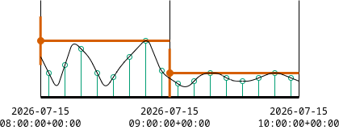

# Best practices

The following is a list of general advice on how to help your module interact seamlessly with other workflows.
Although not obligatory, **Core**{ .badge-core } modules should strive to comply with these guidelines.

## Metadata recommendations

The structure of the configuration, user provided resources, and module results should be clearly structured.
Here are some general recommendations on how to achieve this.

### Embedded metadata

When possible, save important metadata within files instead of producing separate ones.
This can vary from adding a `source` column to a table, to adding metadata to a file's attributes.

The following metadata values are often useful:

- `units`: a dictionary specifying per-column units, using `no_unit` for unitless cases.
- `source`: a string specifying the source and/or author of a dataset.
- `license`: a string specifying the license of the dataset.

??? example "Example: embedding metadata with `pandas`"

    `pandas` will automatically convert data in `df.attrs` into [file-level metadata](https://pandas.pydata.org/docs/reference/api/pandas.DataFrame.attrs.html#pandas.DataFrame.attrs) when saving to `.parquet`:

    ```python
    dataframe.attrs["units"] = {
        "year": "yr",
        "country_id": "no_unit",
        "shape_id": "no_unit",
        "demand": "mwh"
        }
    dataframe.attrs["source"] = "github.com/modelblocks-org/docs"
    dataframe.attrs["license"] = "CC-BY-4.0"
    dataframe.to_parquet('my_data.parquet')
    ```

### Consistent naming

Follow these principles to avoid confusion and reduce the need for extensive documentation.

- **Naming convention**: use snake_case (`foo_bar`) for columns, configuration keys, file names, parameters, etc.
Avoid hyphens (`foo-bar`) and camel case (`FooBar`).
- **Prefer explicit names over implicit ones**: A value's purpose should be clear from its name. For example, use `longitude` and `latitude` to represent a position rather than ambiguous labels such as `x` and `y`.
- **Ensure units are explicit**: configuration values and file attributes should state units explicitly in their naming.

    ???+ example "Example: clear naming of configuration values"

        ```yaml
        maximum_installable_mw_per_km2: # (1)!
            pv_tilted: 160
            pv_flat: 80
        maximum_roof_ratio: 0.80 # (2)!
        ```

        1. Sections should state the unit of their subitems.
        2. Use clear names even for unitless cases like ratios.

- **Use consistent country / subregion identifiers**: do the following when dealing with national and sub-national identification codes.

    - **Country identifiers**: national IDs should be under the `country_id` key and follow [ISO 3166-1 alpha-3](https://en.wikipedia.org/wiki/ISO_3166-1_alpha-3) (e.g., CHE, CHN, GBR, MEX, etc).
    - **Subnational region identifiers**: identifiers related to (sub)national regions/polygons should be under the `shape_id` key.
    This applies even in cases where national resolution is requested (i.e., `country_id`  and `shape_id` should match).

    ??? example "Example: table with country and subnational identifiers"

        | country_id | shape_id | demand_mwh   |
        |------------|----------|--------------|
        | DEU        | DE13     | 4500         |
        | DEU        | DE14     | 4800         |
        | ITA        | ITA0     | 20000        |

- **Standardise currencies**: currency codes must follow [ISO 4217 alpha-3](https://en.wikipedia.org/wiki/ISO_4217) codes in combination with the year of the currency (e.g., CHF2024, EUR2015, USD2020) to allow for clear currency adjustments.


## Timeseries recommendations

### Timestamp ISO standard

Follow [ISO 8601](https://en.wikipedia.org/wiki/ISO_8601) specifications and ensure timeseries include UTC date and time (e.g., `2026-07-15 12:00:00+00:00`) specifications to avoid time interval issues.

??? example "Example: convert timeseries to UTC with `pandas`"

    ```python
    # if the timeseries is already recorded in UTC.
    df["timestamp"] = pd.to_datetime(df["timestamp"], utc=True) # (1)!
    # if the timeseries was recorded for a different timezone
    df["timestamp"] = (
        pd.to_datetime(df["timestamp"])
        .dt.tz_localize("Australia/Sydney")  # (2)!
        .dt.tz_convert("UTC")
    )
    ```

    1. Non-ISO (UTC) -> ISO (UTC)
    2. Non-ISO (Sydney) -> ISO (Sydney) -> ISO (UTC)

### Time period standard

As a general convention, we interpret timestamp periods in a **start-of-period** fashion.
E.g. 00:00 should be the first timestep of the day (covering from 0:00 until 00:59), and 23:00 the last (from 23:00 to 23:59).

Timeseries generally represent parameters that are either _instantaneous_ or _computed_.
Our start-of-period convention applies to both cases.

- **Instantaneous parameters**: these represent the value _at exactly_ the specified timestamp.

    ??? example "Example: instantaneous samples"

        Imagine we are sampling temperature using a sensor in a periodic fashion at 1-hour intervals.

        Assuming instantaneous sampling, the 09:00 would represent the parameter _at exactly_ 09:00.

        

- **Computed parameters**: represent the result of an operation over a collection of instantaneous samples.
This could be a cumulative sum, mean, maximum, minimum, etc.

    ??? example "Example: computed maximum"

        Assume our parameter is the computed maximum over a period of 1-hour.

        Under a start-of-period convention, the 08:00 value would represent the maximum _from_ 08:00 _to_ 09:00.

        


??? warning "Adjusting end-of-period timeseries"

    Some datasets and tools, such as [ERA5 reanalysis dataset](https://confluence.ecmwf.int/spaces/CKB/pages/85402030/ERA5+terminology+analysis+and+forecast+time+and+steps+instantaneous+and+accumulated+and+mean+rates+and+min+max+parameters) and the [`atlite` library](https://atlite.readthedocs.io/en/latest/conventions.html#time-points) provide data in an end-of-period fashion.

    Adjusting to start-of-period is trivial with [`pandas`](https://pandas.pydata.org/docs/reference/api/pandas.DataFrame.shift.html).

    ```python
    start_of_period = end_of_period.shift(freq="-1h")  # (1)!
    ```

    1. Assumes the data already has a `DatetimeIndex`.


## Configuration recommendations

These recommendations relate to the configuration files provided by users (`config/config.yaml`).

### Extra validation

Configuration YAML files should always be validated to detect invalid user settings using the latest [JSON-schema specification](https://json-schema.org/).
However, it might be necessary to write additional tests to catch problems that regular JSON-schema logic cannot guard against.
You can write these tests in a separate validation function.

```python title="Snakefile"
include: "rules/_utils.smk" # (1)
configfile: workflow.source_path("../config/config.yaml")
validate(config, workflow.source_path("internal/config.schema.yaml"))
additional_validation(config)  # (2)
```

1. Defines `additional_validation`.
2. Used for validation checks with more detailed logic.

### Common structures

Here are some recommended structures for configuration settings commonly needed by modules.

1. **Coordinate reference systems**: request users to specify their CRS of choice, and group these under the `crs` key.

    ```yaml
    crs:
      geographic: "EPSG:4326" # (1)!
      projected: "EPSG:3035" # (2)!
    ```

    1. Geographic operations where preserving position matters.
    1. Projected operations where preserving distance or area matters.

1. **Temporal scopes**: if your module supports a flexible temporal scope, define the date range using an _inclusive_ start date and an _exclusive_ end date.

    The range below includes data from `2017` up to, but not including, `2020` (i.e., 2017, 2018, and 2019).

    ```yaml
    temporal_scope:
      start: "2017" # (1)!
      end: "2020" # (2)!
    ```

    1. Will be included in data.
    2. Won't be included in the data.


## Tabular file recommendations

These recommendations relate to tabular data consumed / produced by modules.

### Storage format

We _highly_ recommend the use of [Apache Parquet](https://parquet.apache.org/) (`.parquet`) over other formats (such as `.csv`).

- Very good read/write performance.
- High storage efficiency and [metadata compatibility](https://parquet.apache.org/docs/file-format/metadata/).
- Supports geospatial data thanks to the [Geoparquet standard](https://geoparquet.org/).

### Tidy data principles

We also recommend to follow [tidy data](https://vita.had.co.nz/papers/tidy-data.pdf) principles to make data machine-readable (prefer "long" tables over "wide" ones when applicable).

???+ example "Example of a tidy table"

    | year          | country_id       | shape_id         | demand_mwh   |
    |---------------|------------------|------------------|--------------|
    | 2020          | ITA              | North            | 4500         |
    | 2020          | ITA              | East             | 4800         |
    | 2020          | ITA              | South            | 3000         |


### Validation

As stated in our [Convention][convention], modules should validate inputs whenever possible.
In the case of tabular data, we highly recommend to also validate intermediate tabular files produced by the module.

[`pandera`](https://pandera.readthedocs.io/en/stable/) DataFrame models offer a simple, pragmatic way to achieve this.

??? example "Validating input shapes"

    Input shape files, a.k.a. (sub)national regions are a common input to many modules.
    Below you can find a simple schema that follows the structure of the [Geo-boundaries module](https://github.com/modelblocks-org/module_geo_boundaries).


    ```python
    from pandera import pandas as pa
    from pandera.typing.geopandas import GeoSeries
    from pandera.typing.pandas import Series
    from shapely.geometry import MultiPolygon, Polygon

    class ShapesSchema(pa.DataFrameModel):
        """Schema for geographic shapes."""

        class Config:
            coerce = True  # (1)!
            strict = "filter"  # (2)!

        shape_id: Series[str] = pa.Field(unique=True)
        "A unique identifier for this shape."
        country_id: Series[str] pa.Field(str_length=3)
        "Country ISO alpha-3 code."
        shape_class: Series[str] = pa.Field(isin=["land", "maritime"])
        "Identifier of the shape's context."
        geometry: GeoSeries

        @pa.check("geometry", element_wise=True)
        def check_geometries(cls, geom) -> bool:  # (3)!
            return (
                isinstance(geom, (Polygon, MultiPolygon))
                and not geom.is_empty
                and geom.is_valid
            )
    ```

    1. Attempt to coerce values before raising failures.
    2. Remove columns not specified in the schema.
    3. Check that input geometries are healthy.


## Other GIS file formats

These recommendations relate to non-vectorised GIS files.

### Raster data

For raster data we recommend to use GeoTIFF (`.tiff`, `.tif`) files.
When possible, users should rely on Cloud Optimised GeoTIFF (COG) files, which allow [downloads of specific spatial extents](https://cogeo.org/), saving download bandwidth.

### Gridded data

For gridded data we prefer to use [netCDF](https://www.unidata.ucar.edu/software/netcdf/) (`.nc`) files.

We recommend to follow similar conventions as the [`atlite` library](https://atlite.readthedocs.io/en/latest/conventions.html#grid-coordinates), where coordinates represent points in the **center** of each grid cell.
