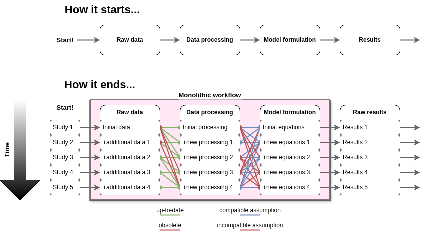
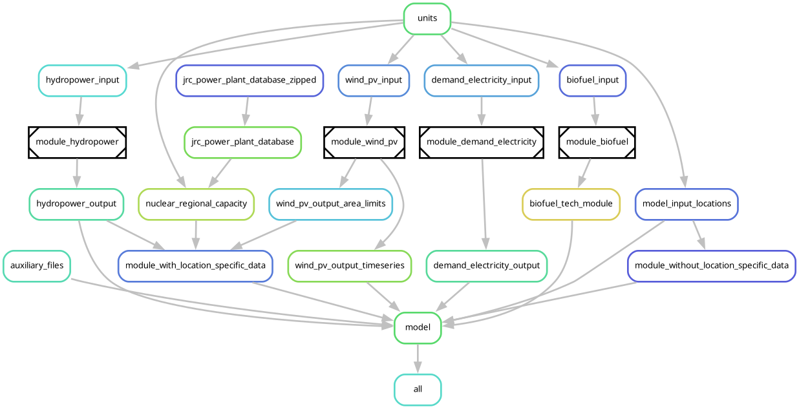
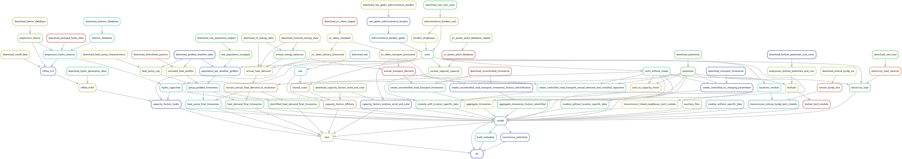

# Background

Modelblocks grew out of the principle of modularising the [building blocks of energy system models](https://doi.org/10.1088/2516-1083/ad371e "Pfenninger-Lee, 2024. Open code and data are not enough: understandability as design goal for energy system models") to allow research teams to share methodologies without prioritising a specific model or tool in particular.

However, in practice it can be applied to any field or modelling domain where the data fed into models is generally similar.
Each model has its own needs and characteristics, but more often than not it will benefit from having access to well structured and standardised input data.

## Challenges

Modelblocks started a response to [challenges seen in energy modelling research](https://doi.org/10.1016/j.enpol.2016.11.046. "Pfenninger-Lee et al, 2017. The importance of open data and software: Is energy research lagging behind?") and similar fields.

1. **Models often become too complex for their own good.**
This complexity makes them difficult to evaluate and replicate, even to the [modellers themselves](https://history.ucsd.edu/_files/faculty/oreskes-naomi/VerificationConfirmationofModels.pdf "Oreskes et al, 1994. Verification, Validation and Confirmation of Numerical Models in the Earth Sciences").
1. **Models have their own nuances and quirks.**
Data produced with exclusively one model in mind is often difficult to reuse in later exercises.
1. **Models and data deteriorate over time.**
Human and natural systems are dynamic by nature, meaning data and methodologies need periodical revision.
Depreciated data, lack of understandibility, and maintenance burdens can ultimately turn a good model into a black box that can be misused.

Over time, models can turn into monoliths that are difficult to maintain, and increasingly harder to understand and share with other researchers.

## Our solution

Modelblocks aims to develop and maintain a collection of reusable, composable data workflows designed with modularity mind from the onset.
We focus on the following core ideals:

- **Model agnostic**: modules should focus on providing good data to the best of their ability.
Model nuances can be added later by users if needed.
- **Replicable, reusable, and reconfigurable**: modules should be easy to reuse and reapply on different contexts, with different assumptions, and on different computer systems.
- **Easily adoptable**: modules should use well established tools in the field of energy systems and be easy to integrate into pre-existing projects.
- **Improvable and manageable**: modules should allow researchers to collaborate on targetted improvements with minimal complications.

Ultimately, Modelblocks aids in turning monolithic workflows into modular ones that are easier to improve and share.

??? info "Compare modular and monolithic modelling approaches"

    === "Modular model"

        Example based on [Euro-Calliope](https://github.com/calliope-project/euro-calliope) with some components abstracted into modules.

        [{ .workflow-comparison-image }](./images/modular.png){ target="_blank" rel="noopener" }
    === "Monolithic model"

        [Euro-Calliope](https://github.com/calliope-project/euro-calliope) in full.
        This version includes additional rules for transport and geopolitical region construction.
        How do they interact with other rules?

        [{ .workflow-comparison-image }](./images/not_modular.png){ target="_blank" rel="noopener" }
