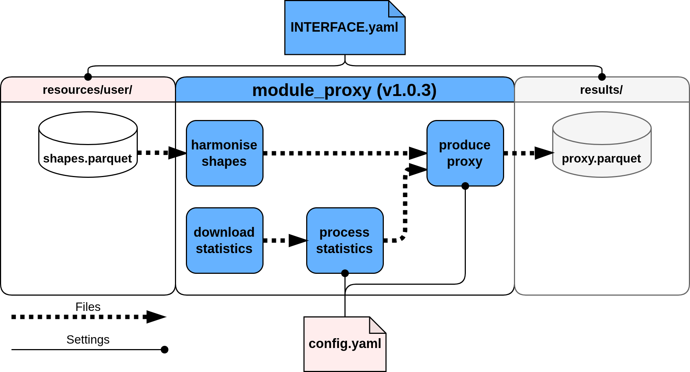

# Basic concepts

Here we explain, in broad strokes, how Modelblocks modules are structured and how to interact with them.
We only focus on aspects that regular users will interact with when using a module for their own research.

??? info "Required reading"

    This section assumes users are familiar with [`Snakemake`](https://doi.org/10.12688/f1000research.29032.2 "Mölder et al., 2021. Sustainable data analysis with Snakemake").
    We recommend reading the following sections in the `Snakemake` documentation before continuing:

    - [Rules and `wildcards`](https://snakemake.readthedocs.io/en/stable/snakefiles/rules.html#snakefiles-and-rules)
    - [Modules and `pathvars`](https://snakemake.readthedocs.io/en/stable/snakefiles/modularization.html#modularization)


??? tip "Looking for more in-depth information on modules?"

    Please consult our [development guidelines][development-guidelines].

## General structure

At their core, Modelblocks modules consist of a sequence of rules that download, filter and transform data.

The behaviour of each rule is determined by the module’s internal code, and a user-specified configuration file which alters code behaviour.
Each module also defines how to interface with it through a standardised interface. The location of configuration and interface files is standard across all Modelblocks modules, and is defined by our [Convention][convention].




### Configuration

Configuration values allow users to tweak module behaviour.
Modules will generally provide example configurations and recommended defaults in the `config/` directory.

You should expect modules to validate the provided configuration against a schema (`config.schema.yaml`) during execution, with incorrect configurations raising errors.
The schema file itself is also a useful resource to understand a module's capabilities.


```bash
.module_name/
├── config/
│   ├── README.md # (1)!
│   └── config.yaml # (2)!
└── workflow/
    └── internal/
        └── config.schema.yaml # (3)!
```

1. Configuration documentation.
2. Example configuration file.
3. Configuration schema file.

### Interfacing

The interface file (`INTERFACE.yaml`) defines the placement and naming of the files needed by the module.

```shell
module_name/
└── INTERFACE.yaml  # (1)!
```

1. Always located at the top level of the module's repository.

The interface file will always specify the version of our [Convention][convention] that the module complies with, multiple sets of `pathvars` that can re-wire the location of the files consumed / produced by the module, and a set of `wildcards` which can be used to process multiple files using the same module.

In general, the interface file will define three different sets of `pathvars`:

- `snakemake_defaults`: composed of logs, resources and results directories.
These are pre-defined by `Snakemake`
- `user_resources`: these are the "input" files that users must provide to the module before execution.
- `results`: the module "output" files that are relevant to users.

??? example "Interface file example"

    Interface requirements will vary per module.
    The following is a generic example of a module with one input and one output file.

    ```yaml
    convention_version: v1.0.0 # (1)!
    pathvars:
      snakemake_defaults: # (2)!
        logs:
          default: "<logs>"
          description: location of rule log files.
        resources:
          default: "<resources>"
          description: "location of module resource files."
        results:
          default: "<results>"
          description: "location of module results."
      user_resources: # (3)!
        shapes:
          default: "<resources>/user/{shapes}/shapes.parquet"
          description: region-specific polygons to process.
      results: # (4)!
        proxy:
          default: "<results>/{shapes}/proxy.parquet"
          description: proxied statistics using the provided shapes.
    wildcards: # (5)!
      shapes: geo-political regions to process
    ```

    1. [Convention][convention] version, based on this documentation.
    2. Default snakemake `pathvars`.
    Used to re-wire the location of _all_ files in these directories.
    3. Notice that these reuse the `<resources>` pathvar!
    4. Notice that these reuse the `<results>` pathvar!
    5. Available wildcards.
    These are used in either `user_resources` or `results`.

## Importing

Modules can be directly imported by other workflows with minimal effort using `module` command.

At minimum, users must specify the module's GitHub repository and version tag under `snakefile`, and provide the necessary module configuration under `config`.

```python
module module_example:
    snakefile:
        github(
            "modelblocks-org/module_example",
            path="workflow/Snakefile",
            tag="v1.0.3"  # (1)!
        )
    config: config["example"] # (2)!

use rule * from module_example as module_example_*  # (3)!
```

1. The tag should be an official module release.
This ensures the module not impacted by future updates, which may alter its behaviour or resource/configuration requirements.
2. We recommend storing module configuration under module-specific keys, or in separate files.
3. Adding a prefix to the module's rules avoids naming conflicts.


## File placement

When imported, modules will also follow a convention on the default location of files they expect to consume and/or produce.

```bash
.my_project/
├── logs/  # (1)!
├── resources/
│   ├── automatic/ # (2)!
│   └── user/ # (3)!
└── results/ # (4)!
```

1. Per-rule log files, useful for debugging.
2. Automatic resources are all the intermediary files created by module rules.
3. User resources are all the input files that a module needs before execution.
These might be optional in some cases.
4. Output files relevant to users.


### Rewiring files

You will often want to modify the expected locations of module logs, resources, and results.
This can avoid file name conflicts, as snakemake does not allow multiple rules to produce the same file, and allows you easily run intermediate rules on module outputs before feeding their results into other modules.

This can be easily handled by re-defining `pathvars` when importing modules.

??? example "Rewiring module logs and results"

    ```python
    module module_example:
        snakefile:
            github(
                "modelblocks-org/module_example",
                path="workflow/Snakefile",
                tag="v1.0.3"
            )
        config: config["example"]
        pathvars:
            logs="modules/example/logs/"
            proxy="results/modules/example/proxies/{shapes}.parquet" # (1)!
    ```

    1. Notice how the "shapes" `wildcard` was changed to be the filename instead of the directory name.
